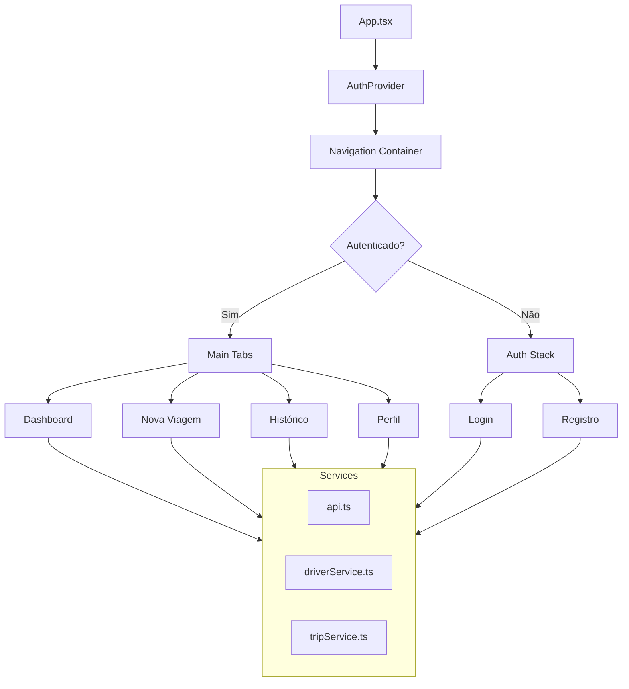
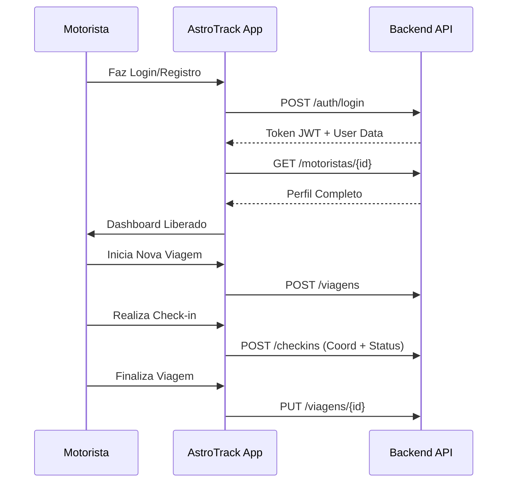

# AstroTrack - Logistics in Orbit


O **AstroTrack** é uma solução mobile avançada para gestão logística e monitoramento de transporte de cargas. Projetado para motoristas modernos, o sistema combina rastreamento em tempo real, segurança (botão de pânico) e gestão de viagens em uma interface intuitiva com temática espacial ("Space Logistics"), garantindo eficiência e segurança "além da órbita".


## Visão Geral

### Objetivo
Otimizar a comunicação entre motoristas e a central logística, fornecendo ferramentas de rastreamento geográfico, registro de eventos de viagem e suporte emergencial imediato.

### Principais Funcionalidades
- **Autenticação Segura:** Cadastro e login com persistência de sessão e descoberta automática de perfil.
- **Gestão de Viagens:** Criação, acompanhamento e histórico detalhado de fretes.
- **Check-in Geográfico:** Envio de coordenadas e status da carga em tempo real.
- **Botão de Pânico:** Alerta imediato para situações de risco (acidente, roubo, quebra).
- **Perfil Profissional:** Gestão de documentos (CPF, CNH) e sincronização de ID com o backend.
- **Dashboard Dinâmico:** Visualização rápida da viagem atual e estatísticas.

### Casos de Uso
1. **Motorista Autônomo:** Inicia uma viagem, registra paradas para descanso e finaliza a entrega com confirmação.
2. **Emergência:** Em caso de sinistro, o motorista aciona o botão de pânico para alertar a central com sua localização exata.


##  Arquitetura

A aplicação foi construída sobre o ecossistema **Expo**, utilizando uma arquitetura modular focada em escalabilidade e manutenção.

### Componentes de Arquitetura
- **State Management:** React Context API para gerenciamento de autenticação global.
- **Service Layer:** Abstração de chamadas API usando Axios com interceptores para injeção automática de tokens.
- **Navigation:** React Navigation (Tabs e Stacks) para fluidez de telas.
- **Styling:** CSS-in-JS com Styled Components para isolamento visual e temas dinâmicos.

### Diagrama de Arquitetura


### Fluxograma de Funcionamento


---

## Tecnologias

| Tecnologia | Finalidade |
| :--- | :--- |
| **React Native (Expo)** | Desenvolvimento Cross-platform (Android/iOS) |
| **TypeScript** | Tipagem estática e segurança de código |
| **Styled Components** | Estilização avançada e temas |
| **Axios** | Cliente HTTP para integração com API |
| **Lucide React Native** | Biblioteca de ícones modernos |
| **Moti / Reanimated** | Animações fluídas e interativas |
| **Async Storage** | Persistência local de dados |


## Estrutura do Projeto

```text
├── assets/             # Ativos estáticos (ícones, splash)
├── src/
│   ├── components/     # Componentes reutilizáveis (Input, Button, TripCard)
│   ├── hooks/          # Hooks customizados (useAuth)
│   ├── navigation/     # Configuração de rotas e menus
│   ├── screens/        # Telas da aplicação (Auth, Main)
│   ├── services/       # Integração com APIs externas
│   ├── theme/          # Design System (Cores, Fontes)
│   └── utils/          # Funções utilitárias (Formatação, Configurações)
├── App.tsx             # Ponto de entrada e Provedores
├── app.json            # Configurações do Expo
└── package.json        # Dependências e scripts
```

---

## Integração com Backend

A aplicação consome uma API RESTful projetada para suporte logístico.

### Modelo de Dados (Identificado)
- **Usuário (Auth):** Credenciais e status da conta.
- **Motorista:** Dados profissionais (CNH, CPF, Telefone).
- **Viagem:** Registro de origem, destino, KM e status.
- **Check-in:** Registro de localização temporal e status da carga.

### APIs e Endpoints

| Método | Endpoint | Descrição |
| :--- | :--- | :--- |
| `POST` | `/auth/login` | Autenticação e geração de token |
| `POST` | `/auth/register` | Cadastro de novas credenciais |
| `POST` | `/motoristas` | Criação de perfil profissional |
| `GET` | `/motoristas/{id}` | Busca perfil do motorista |
| `GET` | `/motoristas` | Lista todos os motoristas (Usado na auto-descoberta) |
| `POST` | `/viagens` | Inicia uma nova jornada |
| `GET` | `/viagens/recentes` | Lista viagens recentes do motorista |
| `POST` | `/checkins` | Registra localização e status atual |

##  Instalação e Execução

### Pré-requisitos
- **Node.js** (LTS)
- **Expo Go** (no celular) ou **Emulador** (Android Studio / Xcode)
- **Git**

### Passo a Passo

1. **Clone o repositório:**
   ```bash
   git clone https://github.com/AntonioCarvalhoFIAP/global-solution-1-devfreitas.git
   cd global-solution-1-devfreitas
   ```

2. **Instale as dependências:**
   ```bash
   npm install
   ```

3. Configure o arquivo `.env` na raiz do projeto:
   ```env
   EXPO_PUBLIC_API_URL=https://astrotrack-api.onrender.com
   ```

4. **Inicie o servidor de desenvolvimento:**
   ```bash
   npx expo start
   ```

## Configuração

### Configurações Especiais
- **Auto-Discovery:** Se o login não retornar o `idMotorista`, o app busca automaticamente na lista de motoristas via nome/email normalizado.

## Troubleshooting

- **ID do Motorista não encontrado:** No login, o app tenta sincronizar seu ID. Se falhar (devido a nomes diferentes entre conta e perfil), use a funcionalidade de **Sincronização Manual** na tela de Edição de Perfil.
- **Erro de Rede (CORS/IP):** Certifique-se de que o backend está rodando no mesmo segmento de rede do seu celular ao usar Expo Go.
- **CPF/CNH Inválido:** O sistema remove acentos e símbolos automaticamente. Insira apenas números.


## Roadmap

- [ ] Suporte a Offline (Registro de check-ins sem internet).
- [ ] Integração nativa com Google Maps para rotas.
- [ ] Upload de fotos de canhotos/comprovantes de entrega.
- [ ] Dark/Light mode dinâmico.


## Vídeo Demonstração
[Youtube]() - Demonstração

## Autores
Artur Correia - [GitHub](https://github.com/artcorreia)
Gabriel H - [GitHub](https://github.com/gabrielhensg)
José Ricardo - [GitHub](https://github.com/jr-iannuzzi) 
Rafael de Freitas - [GitHub](https://github.com/devfreitas)
Rafael Pascotte - [GitHub](https://github.com/pascotterafaaa)

## Licença

*Este projeto está sob a licença **MIT**. Veja o arquivo [LICENSE](LICENSE) para mais detalhes.*
